

# Bloom & Blossom 🌸

### A Modern & Elegant Flower Shop Website

*Crafted with HTML, CSS & JavaScript*

---

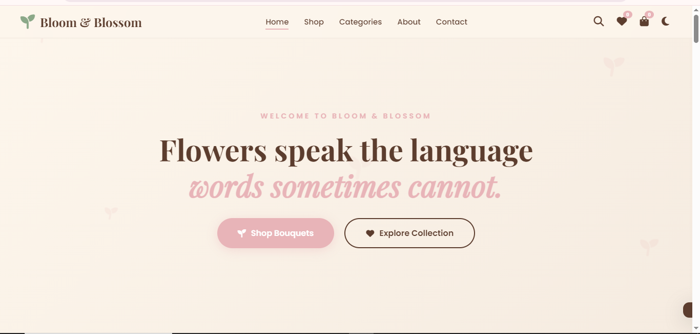

## ✨ About The Project

Bloom & Blossom is my most comprehensive frontend project, built to showcase responsive web design, interactive user interfaces, and modern JavaScript functionality.

Rather than creating a simple landing page, I focused on developing a complete shopping experience with elegant visuals, smooth interactions, and features commonly found in real e-commerce websites.

Every section was carefully designed with consistency, aesthetics, and usability in mind.

---

# 🌷 Features

- 🌸 Responsive Design
- 🛒 Shopping Cart
- ❤️ Wishlist
- 🔍 Live Search
- 👁️ Quick View Modal
- 🌼 Product Categories
- ⭐ Product Filtering
- 📊 Product Sorting
- 🌙 Dark Mode
- 📸 Instagram Gallery
- 💬 Testimonials
- 📩 Newsletter Section
- 📞 Contact Form
- ✨ Smooth Animations
- 📱 Mobile Friendly

---

# 🖼️ Project Preview

## Homepage

---

## Products

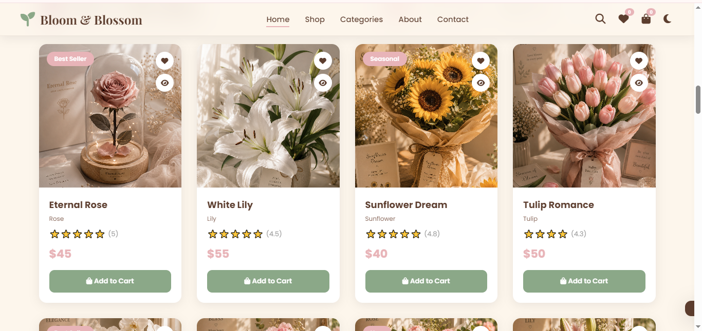

---

## Quick View

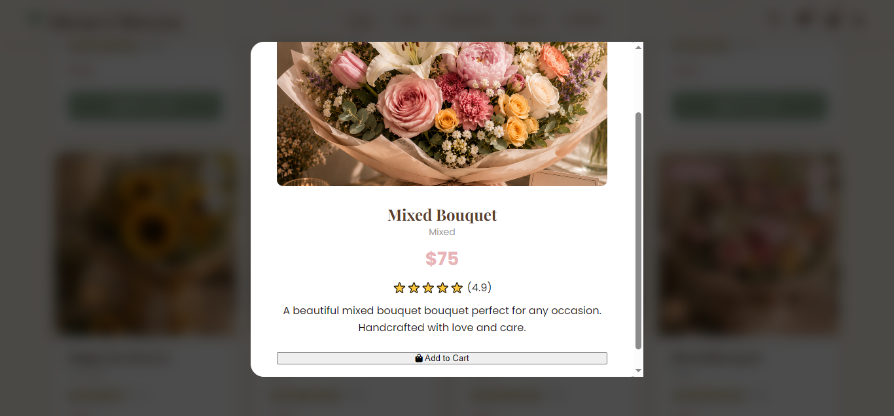

---

## Shopping Cart

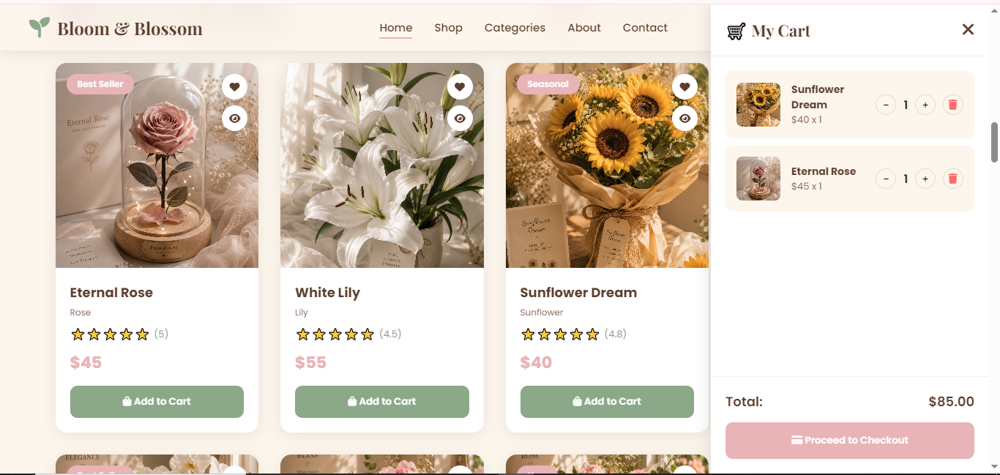

---

## Wishlist

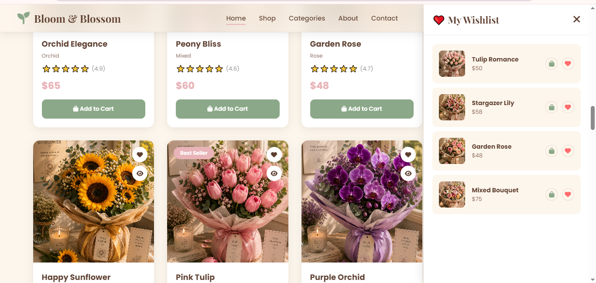

---

## Search

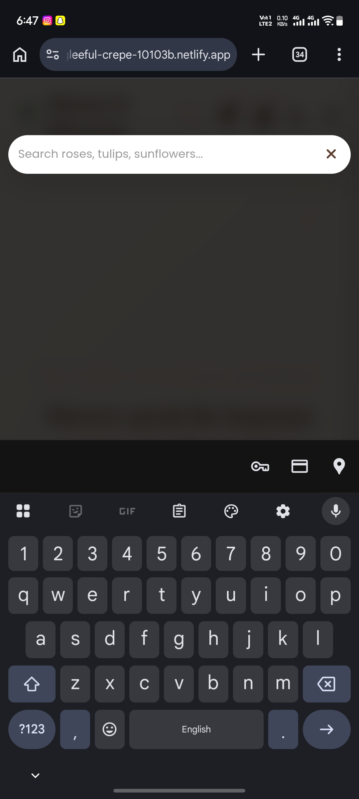

---
## Dark Mode

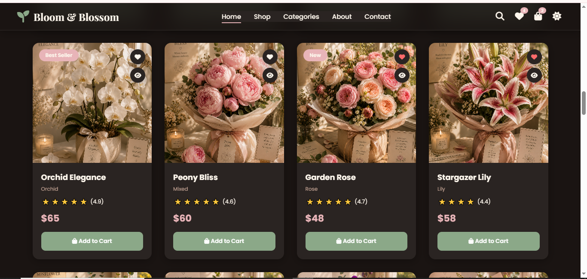

---

## 📱 Mobile Responsive Design

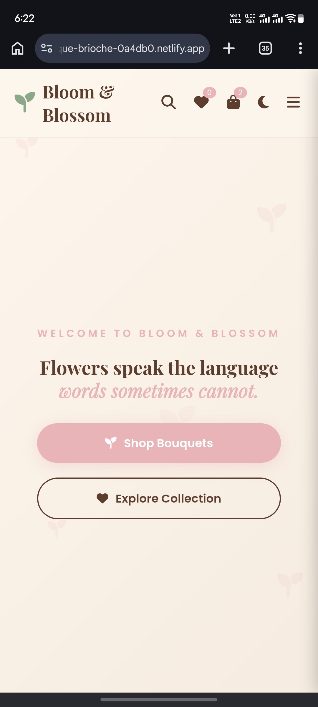
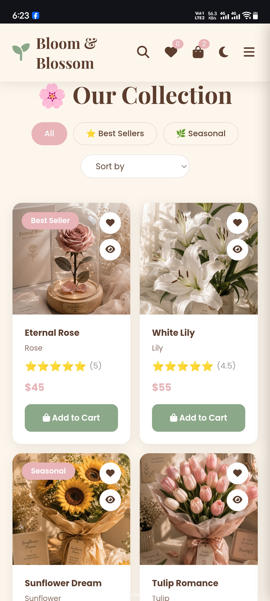
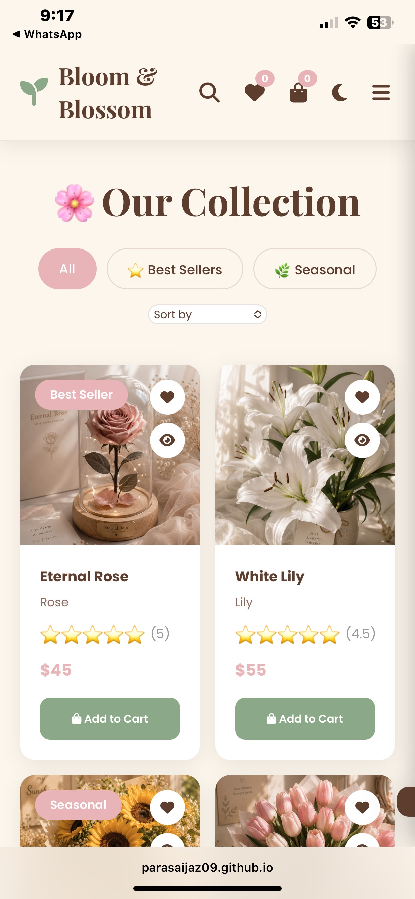
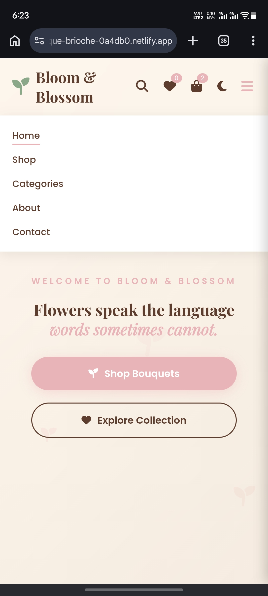

---

## 🛠️ Built With

- HTML5
- CSS3
- JavaScript
- Font Awesome
- Google Fonts

---

## 🎯 What I Learned

During the development of this project, I strengthened my understanding of:

- Responsive Web Design
- JavaScript DOM Manipulation
- Dynamic Shopping Cart Logic
- Wishlist Functionality
- Search & Filtering
- UI/UX Design Principles
- Component-Based Layout Design
- Mobile-First Optimization

---

## 🚀 Future Improvements

- Payment Gateway
- User Authentication
- Backend Integration
- Order Tracking
- Product Reviews
- Database Support

---

## 👩‍💻 Developer

**Paras Aijaz**

Bachelor of Computer Science Student

Frontend Web Developer

---

### ⭐ If you enjoyed this project, consider giving it a star!

Made with 🤍 by **Paras Aijaz**

